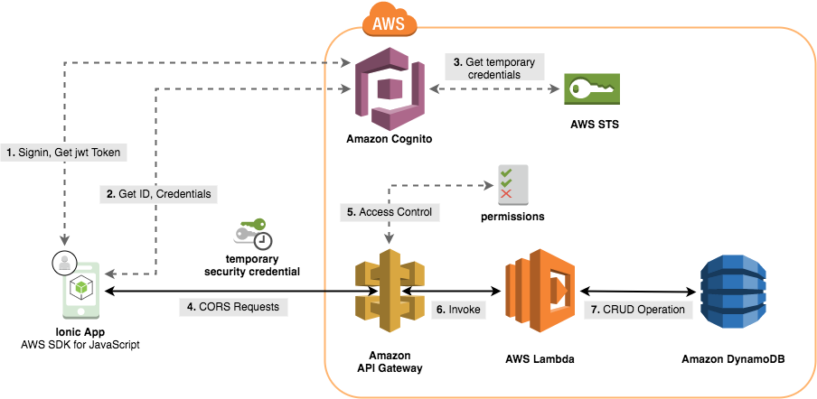
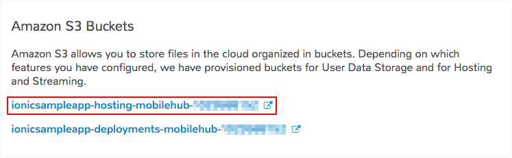
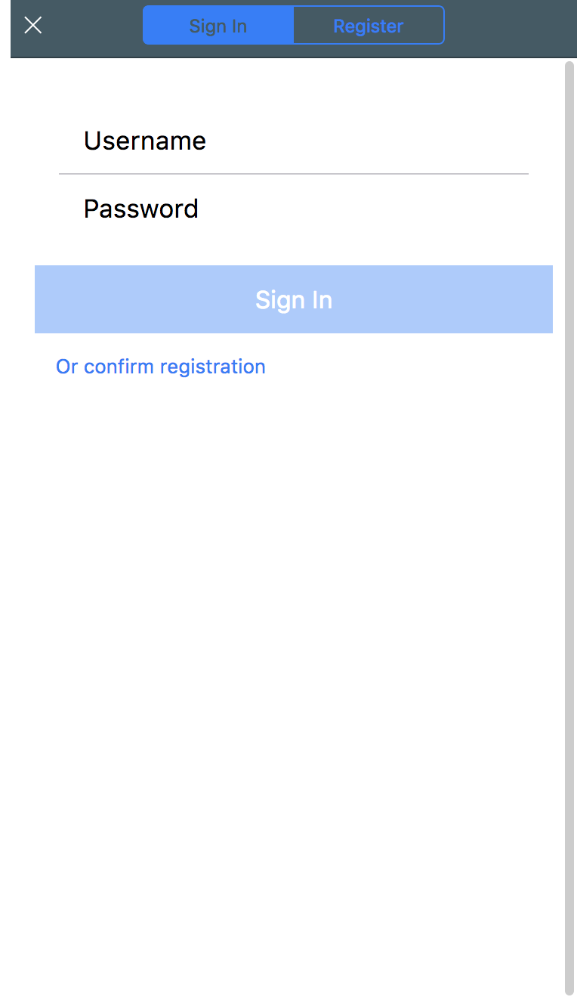

# AWS Mobile Ionic Sample App

### Quicklinks
 - [Getting started](#getting-started)
 - [Building and deploying](#building-and-deploying)
 - [Updating your Lambda Function](#updating-your-lambda-function)
 - [Advanced Usage: Using the Sign-up, Login and Sigv4Http services in your application](#advanced-usage-using-the-sign-up-login-and-sigv4http-services-in-your-application)
   - [Making signed requests for Unauthenticated Users (guests)](#making-signed-requests-for-unauthenticated-users-guests)
   - [Adding support for Authenticated Users](#adding-support-for-authenticated-users)


### Architecture Overview

Bootstrap an application built with [Ionic v2](https://ionicframework.com/) on AWS. Ionic is a JavaScript framework that uses [Angular](https://angular.io/) and [Apache Cordova](https://cordova.apache.org/) to run natively on mobile devices. The app will allow users to create, view, update, and delete project tasks. Users will also be able to sign-up and login to gain access to authorized AWS resources. The app will also provide guests access that will allow users which haven't logged-in to view a summary in a task dashboard.



AWS Services used:
* Amazon Cognito User Pools
* Amazon Cognito Federated Identities
* Amazon API Gateway
* AWS Lambda
* Amazon DynamoDB
* Amazon S3
* Amazon CloudFront

### Prerequisites

* [AWS Account](https://aws.amazon.com/mobile/details/)
* [NodeJS](https://nodejs.org/en/download/) with [NPM](https://docs.npmjs.com/getting-started/installing-node)
* [AWS CLI](http://docs.aws.amazon.com/cli/latest/userguide/installing.html)
* [Ionic CLI](https://ionicframework.com/docs/cli/)

## Getting started

First clone this repo: `git clone https://github.com/gargisingh1993/ionic-sample-app-personalconnectkit`

### Backend setup

1. Set up your AWS resources using AWS Mobile Hub by clicking the button below:

    [](https://console.aws.amazon.com/mobilehub/home?#/?config=https://github.com/gargisingh1993/ionic-sample-app-personalconnectkit/blob/master/backend/import_mobilehub/ionic-sample-app.zip)

1. Update the preselected name of your project if necessary and take note of the region in which your resources are created in. Press **Import project**.

### Client setup


1.  Before proceeding further, in the Mobile Hub console click the **Cloud Logic** tile and import the API that was created for you 'contact-bot-api' and then wait for the API deployment status at the bottom to show **CREATE_COMPLETE** (_this can take a few moments_).

1.  Click **Configure** on the left hand bar of the console and select the **Hosting and Streaming tile**.

1.  At the bottom of the page click **Download aws-config.js file**. Copy this file into the `./ionic-sample-app-personalconnectkit/client/src/assets/` folder of the repo you cloned.

    * Alternatively, click **Resources** on the left hand bar and in the **Amazon S3 Buckets** tile, copy the name of your _hosting_ bucket.

      

      Then, using the CLI:

      ```bash
      aws s3api get-object --bucket <YOUR_BUCKET_NAME> --key aws-config.js ./ionic-sample-app-personalconnectkit/client/src/assets/aws-config.js
      ```

1.  Navigate into  `./ionic-sample-app-personalconnectkit/client` and run:

    ```bash
    npm install
    ionic serve
    ```

    Done!

### Application Walkthrough


1.  Open a browser to `http://localhost:8100` to see your running sample app on the **Dashboard** page. All users have access to this page. However, as a guest user, you do not have access to the **Home** page.

    

1.  Click the blue **_User icon_ in the upper right hand corner** to create a new account. Select the **Register** tab, and type in a username, password, and email address.

1.  You should receive a 6-digit verification code in your email inbox. Type this into the screen and click **Confirm**.

1.  Now that you are signed in, you can click the _User icon_ (which is now green) on the Dashboard page to view some information about your account. You can also sign out from this view.

## Building and deploying

The following steps outline how you can build and deploy the application to a hosted webserver with global CDN on AWS (using S3 and CloudFront) created by the Import phase above:

1.  Navigate to `./ionic-sample-app-personalconnectkit/client` and build for production by running:

    ```bash
    npm run build
    ```

2.  Copy everything within the produced `./ionic-sample-app-personalconnectkit/client/www` directory to the S3 bucket that was created earlier. You can do this one of two ways:

    - Via the Mobile Hub console select the **Hosting and Streaming** section of your project, click **Manage Files** at the bottom which will open the S3 console. Click **Upload** and then **Add files** selecting everything inside the `./ionic-sample-app-personalconnectkit/client/www` directory. Press **Upload**.

    - Via the AWS CLI, using the name of the hosting bucket (see [Client Setup](#client-setup) for instructions on how to get the bucket name)

      ```bash
      aws s3 cp --recursive ./ionic-sample-app-personalconnectkit/client/www s3://<YOUR_BUCKET_NAME>
      ```

3. To view your website, in the Mobile Hub console select the **Hosting and Streaming** section and click the **View from S3** to see your page immediately or **View from CloudFront** to see using a CDN (_note: this might be immediate or take up to an hour_).
=======